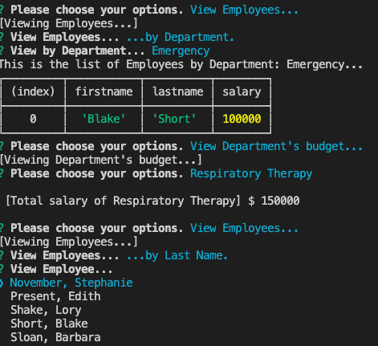

# Homework10 - Hospital Employee Tracker (Using SQL)

**Demonstration Video**


**GitHub Repository URL**
https://github.com/TalkingSkunk/HW10-EmployeeTracker


## Table of Contents

* [Badges](#badges)
* [License](#license)
* [Description](#description)
* [Installation](#installation)
* [Features](#features)
* [Credits](#credits)
* [Contributing](#contributing)
* [Tests](#tests)
* [Contact](#contact)


## Badges
  
  
  
  


## License

MIT License

Copyright (c) 2021 Sam Kim

Permission is hereby granted, free of charge, to any person obtaining a copy
of this software and associated documentation files (the "Software"), to deal
in the Software without restriction, including without limitation the rights
to use, copy, modify, merge, publish, distribute, sublicense, and/or sell
copies of the Software, and to permit persons to whom the Software is
furnished to do so, subject to the following conditions:

The above copyright notice and this permission notice shall be included in all
copies or substantial portions of the Software.

THE SOFTWARE IS PROVIDED "AS IS", WITHOUT WARRANTY OF ANY KIND, EXPRESS OR
IMPLIED, INCLUDING BUT NOT LIMITED TO THE WARRANTIES OF MERCHANTABILITY,
FITNESS FOR A PARTICULAR PURPOSE AND NONINFRINGEMENT. IN NO EVENT SHALL THE
AUTHORS OR COPYRIGHT HOLDERS BE LIABLE FOR ANY CLAIM, DAMAGES OR OTHER
LIABILITY, WHETHER IN AN ACTION OF CONTRACT, TORT OR OTHERWISE, ARISING FROM,
OUT OF OR IN CONNECTION WITH THE SOFTWARE OR THE USE OR OTHER DEALINGS IN THE
SOFTWARE.


## Description

### What needs are we meeting?
* You are a Human Resources Admin at a Hospital,
    * who needs to keep a meticulous record of the muster of all Hospital Employees,
    * So you need a digital SQL database.


### What would be the foreseeable consequences if the needs are unmet?
* You will not be able to keep count of the Employees at the Hospital, leading to lack of organization and effective team work.


### What were your goals?
* Create an interactive database, which allows you to:
  - Add/Edit/Remove an Employee/Role/Department.
  - See the total salary of a Department.
  - View Employees by various catergories.


### What have you done about it?
* All goals are met.


## Installation

* You need to install nodejs to your local computer by downloading LTS from: [ https://nodejs.org/en/ ].
* You need to download the necessary ``` npm packages ``` by entering into your command line:
    1. ``` npm init -y ```, and
    2. ``` npm install ```
* You need to create ``` .env ``` file which will contain your MySQL Workbench password ==> [ PASSWORD = your_password ]
* Run your MySQL server, and your MySQL Workbench.
* Copy and paste into MySQL Workbench:
    1. ``` schema.sql ```
    2. ``` seed.sql ```
* Execute the pasted script in the MySQL Workbench.
* Run ``` npm start ``` on your command line, and follow the prompts.


## Features

```
* Given you have started ``` npm start ``` on your command line,
    * When you do not enter any inputs,
        - Then prompt will give an error message, and refuse to continue.
    * When you finish the prompts,
        - Then the application will perform your requests.
    * When you try to delete a Department with Employees still connected to it,
        - Then the application asks you to relocate the Employees prior to deleting Department.
    * When you try to delete a Role with Employees still connected to it,
        - Then the application asks you to relocate the Employees prior to deleting Role.
```




## Credits

@Fil
@Luca

### Tutorials
* https://developer.mozilla.org/
* https://stackoverflow.com/


## Contributing

[Contributor Covenant](https://www.contributor-covenant.org/version/2/0/code_of_conduct/code_of_conduct.md)


## Tests

The app was tested frequently with console.log throughout the creation.


## Contact

**GitHub: https://github.com/TalkingSkunk**  
**Email: talkingSkunk@pm.me**


&copy; 2021 Sam Kim